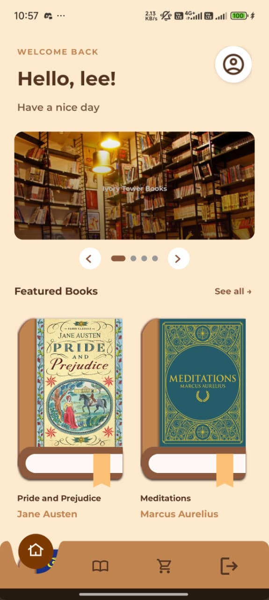
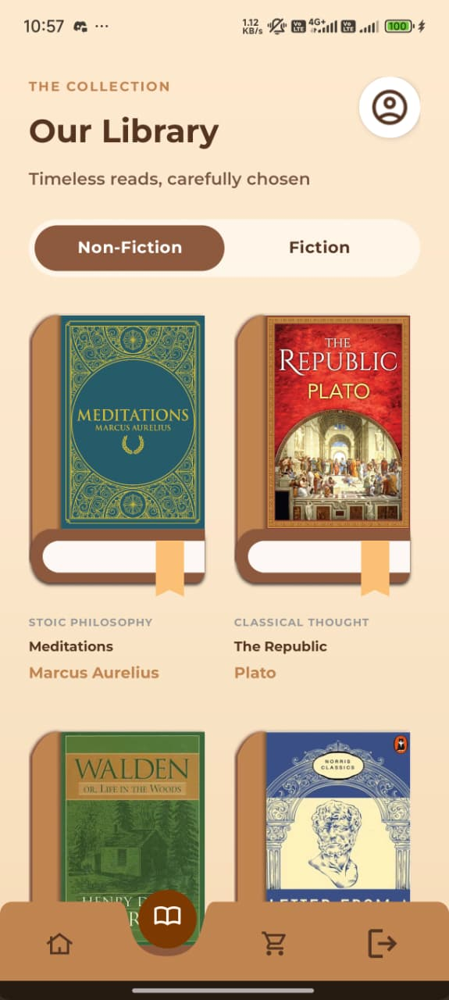

# BookWorm

Aplikasi Android untuk pecinta buku yang menghadirkan pengalaman belanja buku klasik terpilih secara digital — lengkap dengan detail buku, harga, dan informasi toko fisik terdekat. Dirancang dengan antarmuka yang hangat dan elegan, dibangun sepenuhnya menggunakan pure Java dengan pendekatan arsitektur yang bersih dan ringan.

---

## Fitur

- **Splash screen** dengan animasi pembuka
- **Autentikasi** — register dan login dengan validasi form
- **Home** — banner carousel buku featured + grid buku pilihan
- **Books** — daftar lengkap semua buku dengan filter kategori (Fiction / Non-Fiction)
- **Stores** — daftar toko fisik beserta alamat, nomor telepon, dan jam operasional
- **Book Detail** — informasi lengkap buku, harga, dan tombol order
- **Avatar menu** — akses profil dan logout dari semua layar utama

---

## Tangkapan Layar

| Home | Books | Stores |
|:---:|:---:|:---:|
|  |  |  |

---

## Teknologi dan Persyaratan

### Persyaratan Sistem

| Kebutuhan | Versi Minimum |
|---|---|
| Android Studio | Meerkat Feature Drop 2024.3.2 Patch 1 |
| JDK | 11 |
| Android SDK | API 35 (Android 15) |
| Gradle | 8.x |

### Stack Teknologi

| Atribut | Nilai |
|---|---|
| Bahasa | Java |
| Compile SDK | 36 |
| Min SDK | 35 |
| Target SDK | 35 |
| Build Tools | Gradle (Kotlin DSL) |
| View Binding | Aktif |

### Dependensi Utama

| Library | Versi | Kegunaan |
|---|---|---|
| `androidx.appcompat` | 1.x | Kompatibilitas Activity & tema |
| `androidx.recyclerview` | 1.3.2 | Daftar buku dan toko |
| `androidx.viewpager2` | 1.1.0 | Carousel banner infinite-scroll |
| `androidx.core:core-splashscreen` | 1.0.1 | Splash screen native Android 12+ |
| `com.google.android.material` | latest | Komponen Material Design |
| `com.github.bumptech.glide` | 4.16.0 | Loading & caching gambar |

---

## Cara Clone dan Install

### 1. Clone Repository

```bash
git clone https://github.com/username/BookWorm.git
cd BookWorm
```

### 2. Buka di Android Studio

1. Buka **Android Studio**
2. Pilih **File → Open**
3. Arahkan ke folder `BookWorm` yang sudah di-clone
4. Tunggu proses **Gradle sync** selesai

### 3. Jalankan Aplikasi

**Via emulator:**
1. Buka **Device Manager** di Android Studio
2. Buat atau pilih emulator dengan API 35+
3. Klik tombol **Run ▶**

**Via perangkat fisik:**
1. Aktifkan **Developer Options** dan **USB Debugging** di HP
2. Hubungkan HP ke komputer via USB
3. Klik tombol **Run ▶**

**Via terminal:**

```bash
# Build debug APK
./gradlew assembleDebug

# Install langsung ke perangkat yang terhubung
./gradlew installDebug

# Jalankan lint check
./gradlew lint
```

APK hasil build tersimpan di:
```
app/build/outputs/apk/debug/app-debug.apk
```

---

## Struktur Project

```
app/src/main/java/com/example/bookworm/
│
├── model/
│   ├── Book.java           # POJO buku (id, title, author, price, dll)
│   └── Store.java          # POJO toko (nama, alamat, telepon, jam)
│
├── data/
│   ├── Catalogue.java      # Semua data buku & toko hardcoded di sini
│   └── UserSession.java    # Menyimpan state user yang sedang login
│
├── ui/
│   ├── splash/
│   │   └── SplashActivity.java
│   ├── auth/
│   │   ├── LoginActivity.java
│   │   └── RegisterActivity.java
│   └── home/
│       ├── MainActivity.java        # Shell utama dengan bottom navbar
│       ├── HomeFragment.java        # Tab Home
│       ├── BooksFragment.java       # Tab Books
│       ├── StoresFragment.java      # Tab Stores
│       ├── BookDetailActivity.java  # Halaman detail buku
│       └── BookGridDecoration.java  # Spacing grid buku
│
├── adapter/
│   ├── BookAdapter.java        # RecyclerView daftar buku
│   ├── StoreAdapter.java       # RecyclerView daftar toko
│   └── CarouselAdapter.java    # ViewPager2 banner (infinite scroll)
│
└── view/
    ├── BookCoverView.java              # Custom view cover buku 3D via Canvas
    ├── NavbarView.java                 # Bottom navigation bar kustom
    └── ScrollableNestedScrollView.java # NestedScrollView kompatibel ViewPager2
```

---

## Alur Navigasi

```
SplashActivity
      │
      ▼
LoginActivity  ◄──►  RegisterActivity
      │
      ▼
MainActivity
  ├── HomeFragment    ──► BookDetailActivity
  ├── BooksFragment   ──► BookDetailActivity
  └── StoresFragment
```

Navigasi antar tab menggunakan `FLAG_ACTIVITY_REORDER_TO_FRONT` — instance lama diangkat ke depan tanpa dibuat ulang, sehingga scroll position tetap terjaga.

---

## Data Katalog

Semua data bersifat statis dan disimpan di `Catalogue.java`. Tidak ada database maupun koneksi jaringan.

### Koleksi Buku (8 judul)

| Judul | Penulis | Kategori | Harga |
|---|---|---|---|
| Meditations | Marcus Aurelius | Non-Fiction | Rp 95.000 |
| The Republic | Plato | Non-Fiction | Rp 110.000 |
| Walden | Henry David Thoreau | Non-Fiction | Rp 89.000 |
| Letters from a Stoic | Seneca | Non-Fiction | Rp 92.000 |
| Pride and Prejudice | Jane Austen | Fiction | Rp 99.000 |
| The Great Gatsby | F. Scott Fitzgerald | Fiction | Rp 89.000 |
| Jane Eyre | Charlotte Brontë | Fiction | Rp 115.000 |
| Moby-Dick | Herman Melville | Fiction | Rp 129.000 |

### Toko Fisik (4 lokasi)

| Nama Toko | Kota |
|---|---|
| Ivory Tower Books | Bandung |
| Plato's Atheneum | Yogyakarta |
| The Serpent's Archive | Jakarta |
| Alexandria Branch | Surabaya |

---

## Konvensi Resource

| Prefix | Jenis |
|---|---|
| `bg_` | Shape / background drawable (XML) |
| `ic_` | Ikon vektor (XML) |
| `img_` | Ilustrasi / gambar dekoratif |
| `cover_art_` | Gambar cover buku 3D (PNG, `drawable-nodpi`) |
| `store_` | Foto toko (PNG, `drawable-nodpi`) |
| `color_primary_1/2/3` | Palet warna utama di `colors.xml` |

**Font:**
- **Montserrat** — teks UI umum (body, label, tombol)
- **Playfair Display** — teks display (harga, judul buku)

---

## Troubleshooting

**Gradle sync gagal**
- Pastikan koneksi internet aktif saat sync pertama kali
- Coba **File → Invalidate Caches / Restart**
- Periksa versi JDK: harus JDK 11 (`File → Project Structure → SDK Location`)

**Aplikasi tidak muncul di perangkat**
- Pastikan **USB Debugging** aktif di Developer Options
- Coba ganti kabel USB atau port
- Jalankan `adb devices` di terminal untuk memastikan perangkat terdeteksi

**Build error: `AAPT` atau resource tidak ditemukan**
- Jalankan **Build → Clean Project** lalu **Build → Rebuild Project**
- Pastikan tidak ada file di `res/` yang namanya mengandung huruf kapital atau spasi

**Emulator lambat**
- Aktifkan **Hardware Acceleration (HAXM/WHPX)** di BIOS dan Android Studio
- Gunakan **x86_64** system image, bukan ARM
- Kurangi RAM emulator ke 2GB jika memori komputer terbatas
